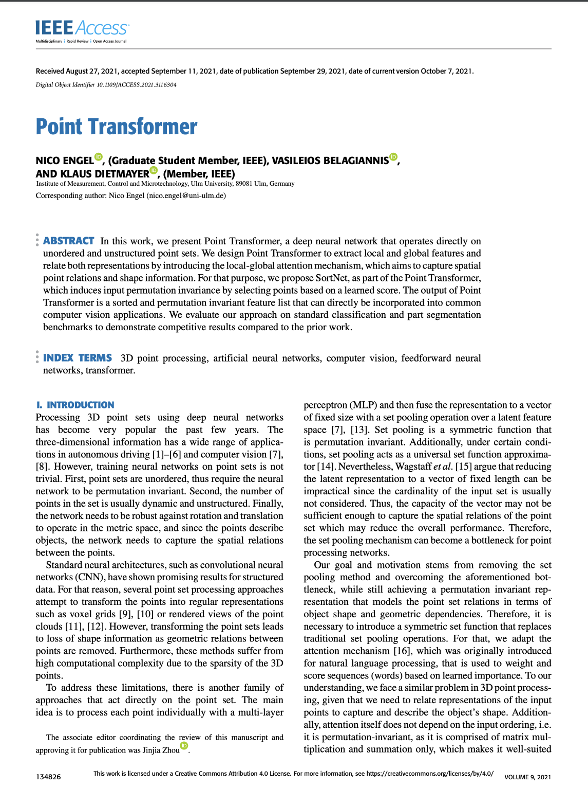
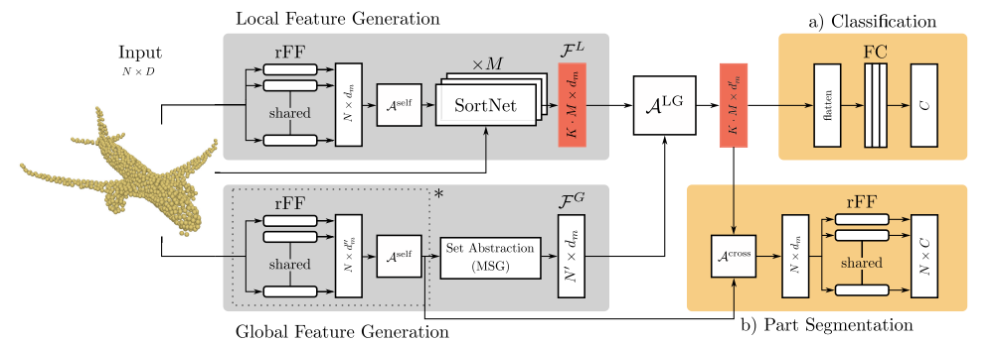

<h1 align="center">Point Transformer</h1> 


<div align="center">
 <br />
 <br />

 
</div>

<h2 align="center">Nico Engel &#8226; Vasileios Belagiannis &#8226; Klaus Dietmayer</h2>

<p align="center">Institute of Measurement, Control and Microtechnology</p>
<p align="center">Ulm University, Germany</p>

  <p align="center">

  </p>
  
<div align="center">
  
[[PDF](https://ieeexplore.ieee.org/document/9552005)] [[PapersWithCode](https://paperswithcode.com/paper/point-transformer)] [[Arxiv](https://arxiv.org/abs/2011.00931)]

</div>

---
**Note: We are currently updating this repository to reflect the results reported in our paper, as well as performance optimizations using state-of-the-art transformer variants**

---

<center>
<h2>Abstract</h2>
</center>

In this work, we present Point Transformer, a deep neural network that operates directly on unordered and unstructured point sets. We design Point Transformer to extract local and global features and relate both representations by introducing the local-global attention mechanism, which aims to capture spatial point relations and shape information. For that purpose, we propose SortNet, as part of the Point Transformer, which induces input permutation invariance by selecting points based on a learned score. The output of Point Transformer is a sorted and permutation invariant feature list that can directly be incorporated into common computer vision applications. We evaluate our approach on standard classification and part segmentation benchmarks to demonstrate competitive results compared to the prior work.
<br/>

<div align="center">

</div>

---

> **Please note, that we are currerntly working to optimize the code. Therefore, expect code changes to happen in the future.**

## 1) Prerequisites

1. Download ModelNet40 dataset from the following url and extract it to `data`:

`https://shapenet.cs.stanford.edu/media/modelnet40_normal_resampled.zip`

2. Download ShapeNet dataset from the following url and extract it to `data`:

`https://shapenet.cs.stanford.edu/media/shapenetcore_partanno_segmentation_benchmark_v0_normal.zip`

The final folder structure should look like this:

```
data
  ├── modelnet40_normal_resampled
  └── shapenetcore_partanno_segmentation_benchmark_v0_normal
```

3. Install all python dependencies from `requirements.txt`, e.g.

```
pip install -r requirements.txt
```

## 2) Usage

Adjust hyperparameters in config dictionary as needed.

### Classification

Run `python train_cls.py` to start training on classification task. Logs are saved in `logs/classification/xxx/logs.txt`.

### Part Segmentation

Run `python train_partseg.py` to start training on part segmentation task. Logs are saved in `logs/part_seg/xxx/logs.txt`.

## 3) Credits

We acknowledge the following repositories for their implementations:

#### RangerVA optimizer

https://github.com/lessw2020/Ranger-Deep-Learning-Optimizer

#### Train Structure / Pointnet Utils / Dataloader

https://github.com/yanx27/Pointnet_Pointnet2_pytorch

## 4) Citation

If you find this method useful and want to cite it, please use the following bibtex entry:

```
@ARTICLE{engel2021point,
  author={Engel, Nico and Belagiannis, Vasileios and Dietmayer, Klaus},
  journal={IEEE Access},
  title={Point Transformer},
  year={2021},
  volume={9},
  number={},
  pages={134826-134840},
  doi={10.1109/ACCESS.2021.3116304}}
```
